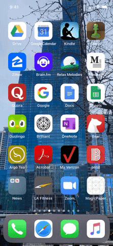

# MagicPaper

## Description 

Inspired by the wizardly world of Harry Potter, this iOS app displays an interactive Newspaper when hovered above images.
ARKit is used to track the 3D object while SpriteKit is used to display the 2D video on said object.

## Prerequisites

<ul>
<li>Xcode 11</li>

<li>iOS 11+</li>

<li>Physical iPhone 8 or above</li>

<ul>

## Building The Code

1. Install the latest [Xcode developer tools](https://developer.apple.com/) from Apple.

2. Clone the repository:

    git clone https://github.com/mozilla-mobile/firefox-ios
    
3. Open MagicPaper.xcodeproj in Xcode.

4. Build MagicPaper in Xcode.

## Demo

## Supports

Swift; iOS 11+
